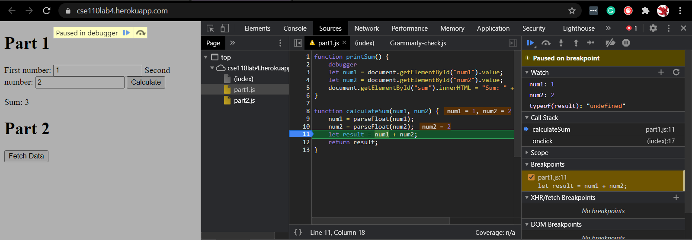
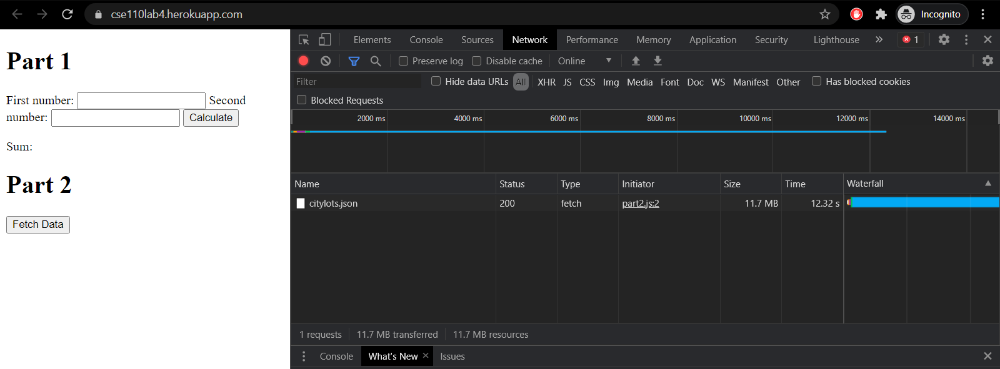

# DevTools - Debugging

## What was the bug?
The bug was that the original program was concatenating strings instead of doing arithmetic operations on the numerical versions of the inputs.

## How would you fix it? Include a screenshot of your fix.
To fix this, I added conversions from strings to numbers (floats because the user may use decimals) for both inputs so the result would be an arithmetic result.

---

# DevTools - Network Tab

#1. What is the name of the new json file?
citylots.json

#2. Which file initiated the download of the new file?
part2.js

#3. What is its file size?
The file size of citylots.json is 11.7MB

#4. How long did it take to download?
citylots.json took 12.32 s to download.

---

#5. What was your User-Agent for the browser that made the request?
Mozilla/5.0 (Windows NT 10.0; Win64; x64) AppleWebKit/537.36 (KHTML, like Gecko) Chrome/88.0.4324.104 Safari/537.36

#6. In the response, what type of server did it come from?
Apache

#7. When was the file last modified?
Tue, 26 Jan 2021 22:14:13 GMT

#8. What was the Content-Type of the file?
application/json

---

#9. Which method inside the initiating file made the request?
fetchData()

